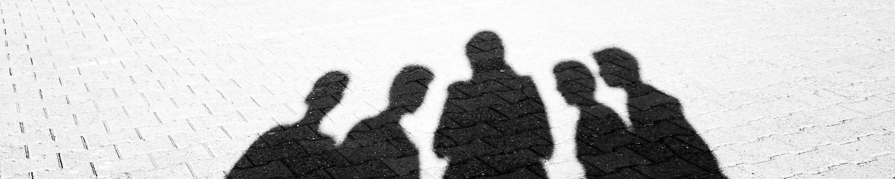
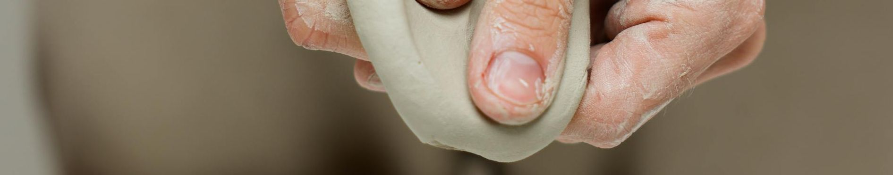
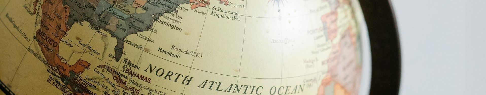

# CS 4620/8626 - Spring 2026 - Topics
These are the topics we are going to cover in class each day. Links to [example student videos ](https://www.youtube.com/playlist?list=PLH9qo0GKu2iQgPuzozltIuvLgEddxc43L) and [slides from class](https://uofnebraska-my.sharepoint.com/:f:/g/personal/17816140_nebraska_edu/IgCHg5Sr1POTT4uZ0xpYHfWsAcBjrFnqAThYk6a3sROkT3Y?e=5PhlNM)

  
---
---

# Day 04 - January 29 - Shading 2 [Blender] (🧑‍🏫Lecture 4)

## 📢Announcements
- It's time to prepare for our first sprint
- Here are some topics that might appear on a quiz:
  - Vector Length
  - Vector dot product
  - Vector cross product
  - Coordinate Systems (left and right handed)
  - Questions about very basic modeling
  - Questions about very basic lighting

## 🔙Review
- Consider vector A (1, 0, 0) and vector B(1, 1, 0)
- What is A cross B?
- What is A dot B?
- What is the length of A?
- What is the length of B?

## How to add color to objects in blender
- Base colors (diffuse)
- Specular highlights (roughness)

## Texturing
Wrapping paper
Activity: Wrapping paper

Wrapping maps
Activity, Reviewing mapping projections

Look at the Wolfenstein 3D

## Blender UV Activity
- Look at the UV maps for a sphere
- UV map projections
- Save UV map outlines for space ship

## Different renderers
  
## Math Starter
- Normalize vectors
- Interpolate normals across a triangle

## Interpolate normal
Barycentric coordinates
- See calculator

## Actual texture maps
- See head texture map

## Professional software
Substance 3D
Activity: Review Substance 3D demoreel/website
https://www.youtube.com/watch?v=TzMHqw0Qp-s

  <!-- ## Normal maps -->

# Day 03 - January 27 - Shading 1 [Blender] (🧑‍🏫Lecture 3)

## 📢Announcements
- It's time to prepare for our first sprint

## 🔙Review
- What is a right-handed cross product?
  - $a\times b$ gives a vector that is orthogonal to $a$ and $b$
  - $x = a_y \cdot b_z - a_z \cdot b_y$
  - $y = a_z \cdot b_x - a_x \cdot b_z$
  - $z = a_x \cdot b_y - a_y \cdot b_x$

  <!-- ## Math Review
  Do a dot and cross product
  See Today for websites with tools -->

## 💡New Idea: 
  - Look at different clips from videos. How is lighting use to tell a story or set a mood?

> [!Tip] History Moment
>
> Snow White was the first fill length animated film. Throughout the film you see that in some scenes the characters have shadows and in other they didn't
>
> You can see in other animated films, for example Robin Hood, that shadows were abandoned for budget reasons

## 💡New Idea: Ambient Lighting
- Light is always bouncing around us. Ambient lighting is a 'fudge' term that tries to capture this reflected light.

## 👩‍💻Activity
- Adjust the ambient lighting in Blender

> [!Tip] History Moment
> Early FPS games only used ambient lighting. For example look at Wolfenstein 3D, the predecessor to Doom. 

## 💡New Idea: Diffuse Lighting
- How does light reflect at an atomic level?
- How does the angle to a light affect the amount of diffuse lighting?
  - Talk about sun burns and seasons
- The difference between a surface's normal and the direction to the light source determine the amount of illumination
  - The normal of a surface is the vector that is perpendicular to the tangent of the surface
- The difference between normals can be found by calculating the dot product between them.

## 👩‍💻Activity: Add Diffuse Lighting in Blender
- Look at different light types
  - Spot
  - Sun
  - Point
  - Area
    - Why do area lights cause noise in the rendered image?

 

  <!-- ## Shading in Blender
  - Different shading views in main view
  - Changing ambient light in the world tab
  - Adding a material to a mesh -->

  <!-- ## Shader tab in Blender
  - Visual scripting
  - Pins and wires
  - Add ambient, diffuse, and specular (glossy) shaders -->

## Normals on Objects
  - Different kinds of shading in Blender (smooth v flat)
  - Normals as an attribute of vertices gives us a way to hint at the curvature of a surface.

  <!-- ## Normal maps
  •	In Blender:
  Create a high-poly and low-poly mesh. 
  •	Add details to the high-poly mesh
  •	Add a shader to the low-poly mesh.
  •	Create and select an image texture in that shader
  •	Chane renderer to cycles
  •	Open bake tab.
  •	Change from Combined to Normal
  •	Select selected to active
  •	Set Extrusion to 1m
  •	Bake -->

  <!-- ## OBJs -->

  <!-- ## Example
  Professional Shaders – Pixar – https://vimeo.com/568462499 -->

# Holiday - January 22 - (Class Canceled)

# Holiday - January 20 - (Class Canceled)

# Day 02 - January 15 - Model Space [Blender] (🧑‍🏫Lecture 2)

## 📢Announcements
- No class on the 20th or 22nd

## 🖼️Activity: Review the Syllabus 

## 💡New Idea: Editing Content in Blender in Model Space
- Content in Blender in represented by a combination of:
  - Vertex, a vector in 3D space
  - Edge, a point of vertices
  - Face, a set of edges 

## 🌎Historical Context: Review Original Star Wars History
- [Opening sequence in Star Wars: A New Hope](https://youtu.be/tRX4JFWffkM?si=G1V2hkSZJdOxqOL_)

## 🖼️Activity:  Use reference images to model a Star Destroyer
- Start with [schematic images of a Star Destroyer](https://t.ly/hzJvW)
- Idea: X-ray Mode
- Idea: Model space
- Idea: Reference images
- Idea: Extrude
- Idea: Mirror
  <!-- ::Video:: What you can do in Blender timelapse: https://www.youtube.com/watch?v=8VRtkdRPnos -->

## 💡New Idea: Cross Products
- Blender knows how to do an extrude by using a cross product
- $a\times b$ gives a vector that is orthogonal to $a$ and $b$
- $x = a_y \cdot b_z - a_z \cdot b_y$
- $y = a_z \cdot b_x - a_x \cdot b_z$
- $z = a_x \cdot b_y - a_y \cdot b_x$

# Day 01 - January 13 - World Space [Blender] (🧑‍🏫Lecture 1)

## 🖼️Activity: 3D Computer Graphics in Story Telling
- Watch a film with heavy use of 3D Computer Graphics. (For example, consider [Rouge One](https://www.youtube.com/watch?v=kaAmF8gy6eQ) (start at 3:20?))
  - What kind of emotions is the director trying to evoke? 
  - How do computer graphics help us achieve that?
  
  <!-- ## Intro
  🏃‍♂️Seeing the world
  Bring pencil and paper
  Draw an orange w/o seeing the basketball
  Show the orange and draw basketball
  https://www.pexels.com/photo/orange-fruit-161559/
  https://www.youtube.com/watch?v=ItY5chvVZoA -->

## 💡New Idea: Fundamental problem of graphics
- Avagadro’s number
- We can never simulate at first principles, therefore everything has to be a simplification
- You can see example of this in a video that shows [meshes in Substance 3D Painter demo reel](https://www.youtube.com/watch?v=IOe154tJSQA) (up to :19)

## 👩‍💻Code Together: Create something in world space
- ::Video:: See the [city in Inception](https://www.youtube.com/watch?v=YoHD9XEInc0) (Start around 2:00)
- 🏃‍♂️Draw a city in Blender using cubes in world space.
- 🏀 Translate/Scale/Rotate
- 💡 x/y/z -> r/g/b
- 💡Moving windows in Blender
- 💡 n to bring out panels in Blender
- 💡 numbers to change view
- 💡 Apply changes
- 💡 Move pivot
- ⚠️ Laptops need to turn on emulation

## 💡New Idea: About Blender
- Blender v Maya v 3DSMax (ZBrush, Cinema 4D)
- What you can do in [Blender timelapse](https://www.youtube.com/watch?v=8VRtkdRPnos)

## 💡New Idea: Major Translations
-  How could you translate/scale/rotate in code?
-  Homogenous coordinates
-  Major Affine Transformation Matrices
   -  Translate:
      -  $`\begin{bmatrix}0 & 0 & 0 & T_x\\0 & 0 & 0 & T_y\\0 & 0 & 0 & T_z\\0 & 0 & 0 & 1 \\\end{bmatrix}`$
   -  Scale:
      -  $`\begin{bmatrix}S_x & 0 & 0 & 0\\ 0 & S_y & 0 & 0\\0 & 0 & S_z & 0\\0 & 0 & 0 & 1 \\\end{bmatrix}`$
   -  Rotation:
      -  Rotation based on this basic 2D rotation pattern:
      -  $`\begin{bmatrix} cosine(\theta) & -sine(\theta) \\ sine(\theta) & cosine(\theta) \\\end{bmatrix}`$
   -  Rotation about X:
      -  $`\begin{bmatrix}1 & 0 & 0 & 0\\ 0 & cosine(\theta) & -sine(\theta) & 0\\0 & sine(\theta) & cosine(\theta) & 0\\0 & 0 & 0 & 1 \\\end{bmatrix}`$
   -  Rotation about Y:
      -  $`\begin{bmatrix}cosine(\theta) & 0 & sine(\theta) & 0\\ 0 & 1 & 0 & 0\\ -sine(\theta) & 0 & cosine(\theta) & 0\\0 & 0 & 0 & 1 \\\end{bmatrix}`$
   -  Rotation about Z:
      -  $`\begin{bmatrix}cosine(\theta) & -sine(\theta) & 0 & 0\\ sine(\theta) & cosine(\theta) & 0 & 0\\0 & 0 & 1 & 0\\0 & 0 & 0 & 1 \\\end{bmatrix}`$

## 💡New Idea: Coordinate Systems
- Left-handed v right-handed coordinate systems
