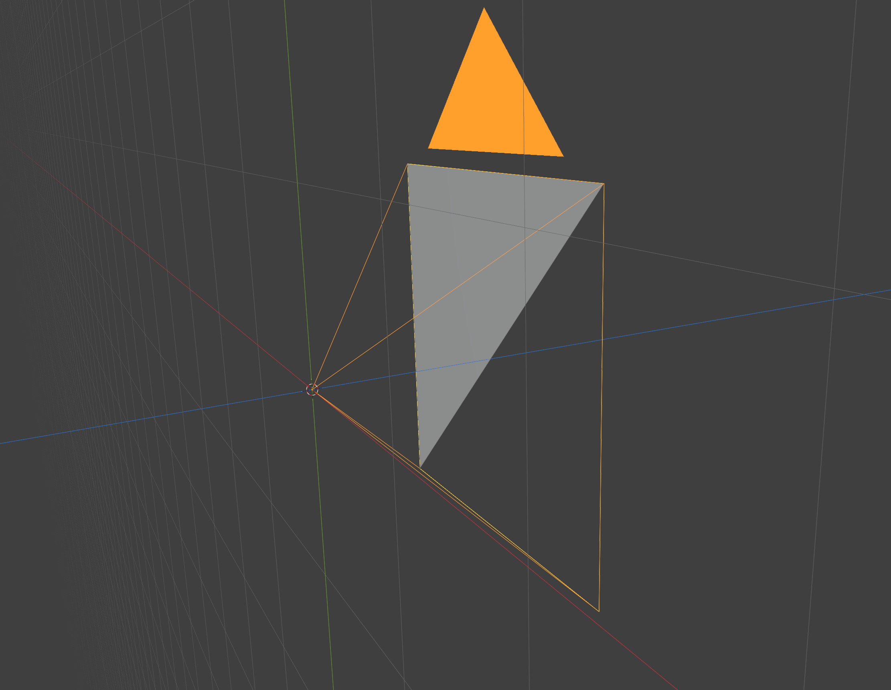
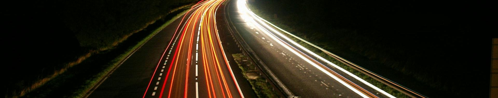
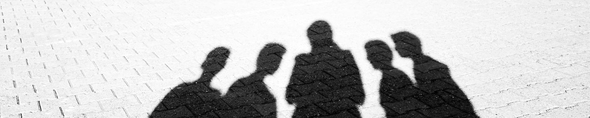
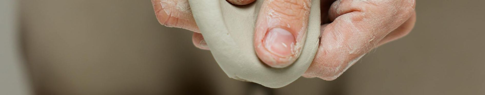
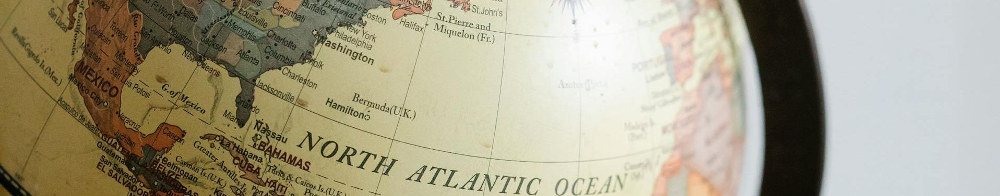

# CS 4620/8626 - Spring 2026 - Topics
These are the topics we are going to cover in class each day. Links to [example student videos ](https://www.youtube.com/playlist?list=PLH9qo0GKu2iQgPuzozltIuvLgEddxc43L) and [slides from class](https://uofnebraska-my.sharepoint.com/:f:/g/personal/17816140_nebraska_edu/IgCHg5Sr1POTT4uZ0xpYHfWsAcBjrFnqAThYk6a3sROkT3Y?e=5PhlNM)

<br/><br/>
--- 
---

# Day 22 - April 9 - First Full Ray Tracer (🧑‍🏫Lecture)

## 🖼️Activity:
- [Commentary of Ray Tracing in Pixar Films](https://www.youtube.com/watch?v=BWbYhW5PNdQ&t=139s)

## 💡New Idea: Barycentric Coordinates
- Review Barycentric coordinates

## 👩‍💻Code Together:
- Determine if a point on a plan is in a triangle using Barycentric coordinates
  - Find the area of the whole triangle using cross products
  - Find the three vectors from the point to the triangle vertices
  - Find the three Barycentric Coordinates
  - See if the coordinates sum to one

## 💡New Idea: Proper class defintion in C++
- Move Vector3 to a .hpp file
- Add #ifndef
- Add a .cpp file
- Update the compile command

## 👩‍💻Code Together: Create Triangles and Meshes
- A mesh has an array of triangles and a shader
- A triangle has three Vector3s
  

## 🧭Ideas to explore on your own
- How would you import an obj into a ray tracer?

## 🏁Final Code
- [The final code for today](https://github.com/cs4620/Spring26-Day22-Multiple-Triangle-Ray-Tracer)
<br/><br/>
---
---


# Day 21 - April 7 - (👟Sprint)
<br/><br/>
---
---


# Day 20 - April 2 - Ray Tracing Basics [Ray Tracing](🧑‍🏫Lecture)


## 💡New Idea: Ray Tracing 
- We want to send ray into the scene
- We render a pixel at a time instead of a triangle at a time (rasterizing)

## 🖼️Activity:
- Consider a simple ray tracing setup with one triangle:

- We have a camera with an origin at [0,0,0]
- We have a camera center target at [0, 0, -1]
- We have a camera field of view that extends from -1 to 1 in x and y when it reaches z=-1
- The triangle has three points:
  - [-1, -1, -1]
  - [-1, 1, -1]
  - [1, 1, -1]
- There are w=h pixels across the final image we are rendering to.


## 👩‍💻Code Together:
1. We need the following functions for vectors in order to build this ray tracer
  - add
  - subtract
  - scale
  - dot
  - cross
  - length
  - normalize
2. For each pixel in the final image, to send a ray through that pixel
  - We find where that ray will collide with the Z-plane
  - We normalize the result to get a direction
3. We need to find where the ray collides with the plane that the triangle defines
  - A plane can be defined as $Ax+By+Cz+D=0$ where $A, B, and C$ are the normal of the triangle
  - This `D`, the planes distance from the origin, can be found by negating the dot product of any point on the plane and the plane's normal.
    - Since each of the points in the triangle definition are in the plane, we can use that 
  - Once we have the definition of the plane, we can find where the ray through the pixel collides with the plane:
    - $N\cdot(o+r\cdot T)+D=0$
    - $N\cdot(o+r\cdot T)=-D$
    - $o\cdot N+r\cdot N\cdot T=-D$
    - $r\cdot N\cdot T=-D-o\cdot N$
    - $T=(-D-o\cdot N)/(r\cdot N)$
4. Once we have $T$, we can find the collision point as $o+r\cdot T$.
5. Once we know where the ray intersects the plane, then we need to find whether that point is in the triangle.
   - (Note that there are many different ways to doing this.)
   - A point $p$ is in a triangle if for all vertices $v_k$ in the triangle, the cross product of  $v_k-p$ and $v_k-v_{k+1}$ is positive.
   - We loop through all the points in the triangle, find the difference to $p$, and take the cross product of the appropriate leg.
   - If they are all positive, we are in the triangle
6. Once we know if a point is in the triangle, we assign it the triangel color if it is, otherwise we assign the background color to the pixel
7. Once we know all the pixel colors, we write them to the final image.

## 🏁Final Code
- [The final code for today](https://github.com/cs4620/Spring26-Day20-One-Triangle-Prep)
<br/><br/>
---
---


# Day 19 - March 31 - (👟Sprint)
<br/><br/>
---
---


# Day 18 - March 26 - OBJ Import [Rasterizing] (🧑‍🏫Lecture)

## 🖼️Activity:
- Look at wavefront technology:
- [Star Trek: Voyager Opening Credits](https://www.youtube.com/watch?v=uDaOYj2wggg)
- [Twister Tornadoes](https://www.youtube.com/watch?v=HmNiJjCbeqg)

# 🖼️Activity
- Comparing different export formats
  - [OBJ - Human Readable](https://en.wikipedia.org/wiki/Wavefront_.obj_file)
  - [FBX - Common for games](https://code.blender.org/2013/08/fbx-binary-file-format-specification/)
  - [USD - The new and shiny format for film](https://www.pixar.com/openusd)

## 💡New Idea: OBJ Files
- You only need to pay attention to the following lines:
  - v (three floats that define the x, y, and z of a vertex location)
  - vt (two floats that define the u, and v of a vertex texture coordinate)
  - vn (three floats that define the x, y, and z of a vertex normal)
  - f (three triples in `v_index/vt_index/vn_index` format that define the three vertices in a triangle)
- Indices are 1-based instead of the traditional 0-based used across computer science

- You can ignore everything else

- Example OBJ file for a triangle
  - Note that this example excludes lines we should ignore
```obj
v 0.000000 0.000000 0.000000
v 1.000000 0.000000 0.000000
v 0.000000 1.000000 0.000000
vn -0.0000 -0.0000 1.0000
vt 0.000000 0.000000
f 3/1/1 1/1/1 2/1/1
```

- Example for a (slightly) more complex shape
  - Note that this example includes lines we should ignore
```obj
# Blender 5.1.0
# www.blender.org
o Cube
v -1.000000 -1.000000 -1.000000
v -1.000000 -1.000000 1.000000
v 1.000000 -1.000000 -1.000000
v 1.000000 -1.000000 1.000000
v 1.000000 1.000000 -1.000000
v 1.000000 1.000000 1.000000
vn 1.0000 -0.0000 -0.0000
vn -0.0000 -1.0000 -0.0000
vt 0.625000 0.500000
vt 0.375000 0.750000
vt 0.375000 0.500000
vt 0.625000 0.750000
vt 0.375000 1.000000
vt 0.625000 1.000000
s 0
f 6/1/1 3/2/1 5/3/1
f 4/4/2 1/5/2 3/2/2
f 6/1/1 4/4/1 3/2/1
f 4/4/2 2/6/2 1/5/2
```


  
## 👩‍💻Code Together:
- OBJ

## 💡New Idea: OBJ File Export
- Tips for exporting from blender:
  - Check the Forward Axis and Up Axis
    - Recommended: Forward Axis set to Y and Up Axis set to Z
  - Turn on Geometry->Triangulated Mesh
    - Otherwise you might not get everything as triangles.
- You do not need to import material properties from blender
  - You are welcome to as something that goes above and beyond, but it is not required
- You do not need to import multiple objects from blender
  - You are welcome to as something that goes above and beyond, but it is not required
- You can simplify your blender project so that it works better when importing
  - For example, combining objects or reducing geometry count.
- You do not need to import animation from blender
  - You are welcome to as something that goes above and beyond, but it is not required
- **Do not debug your OBJ importer with a complex mesh.**
  - Start with a simple mesh (i.e. one triangle) and then slowly expand (i.e. to a cube) until your code can handle a large mesh.


## 🏁Final Code
- [The final code for today](https://github.com/cs2510/Spring26.rasterizer-prep)
<br/><br/>
---
---

# Day Day 17 - March 24 - (👟Sprint)
<br/><br/>
---
---


# Day Day 16 - March 12  - Class Cancelled (🧑‍🏫Lecture)


# Day 15 - March 10  - Class Cancelled (👟Sprint)
<br/><br/>
---
---


# Day Day 14 - March 5 - Vertex Shaders and OpenGL (🧑‍🏫Lecture 9)

## 🖼️Activity:
- Review previs
- https://www.youtube.com/watch?v=bgvgi3ShcmY
- Review Render Time
- https://www.youtube.com/watch?v=aE1d2Chrq-A

## 💡New Idea:
- 

## 👩‍💻Code Together:
-

## 🧭Ideas to explore on your own
- 

## 🏁Final Code
- [The final code for today](https://github.com/cs2510/Fall2025.Day)
<br/><br/>
---
---


# Day 13 - March3 - (👟Sprint)
<br/><br/>
---
---


# Day 12 - February 26 - Shader Basics [Rasterizing] (🧑‍🏫Lecture 8)

# 💡New Idea: GPU Shader APIs
- DirectX
  - Pioneered by Microsoft. Popular on PCs and XBox
  - Allows high or low-level usage
- Vulkan
  - Cross platform, low-level library
- Metal
  - Apple's low-level library
- OpenGL
  - OpenGL is officially deprecated, but is still used.
  - High-level API

# 💡New Idea: GPU Shader Pipeline
- Clear Z Buffer 
- Review Vertex Shaders
  - Vertex shaders take model vertices and project them onto the screen
- Review Z Buffer
- Review Fragment Shaders
  - Find the final color for fragments (pixels) 
- Copy colors from Z-Buffer to screen


# 💡New Idea: GLSL Decorators
- Shader language is similar to C, with the addition of decorators
- OpenGL's shader language in called `GLSL`, or graphics library shader library
  - Compare to HLSL, Microsoft's language for DirectX
- Decorators proceed the variable type declaration
- [decorator] [type] [variable name]
  - For example: `uniform mat4 worldMatrix;`
- Uniforms in classic OpenGL
  -  `uniform` - values that are constant across all triangles
  -  `attribute` - values that change per vertex
  -  `varying` - values that change per fragment

# 💡New Idea: GLSL variables
- `float` - a scalar
- `vec2` - a 2D Vector
- `vec3` - a 3D Vector
- `vec3` - a 4D Vector
- `mat3` - a 3x3 Matrix
- `mat4` - a 4x4 Matrix

# 💡New Idea: Setting the final color of a fragment
- Set the `gl_FragColor` to set the final color of a fragment
- This is a `vec4`

# 💡New Idea: Ambient Light
- Adding a constant vec3 to `gl_FlagColor` adds ambient light

# 💡New Idea: Diffuse Light
- Diffuse light is calculated by finding the dot product of the normal and the direction to the light
- If the dot product is below zero, then we set it to 0
  - A common bug is to accidentally subtract light
- Multiply the dot product by the color of the diffuse surface to get a final diffuse contribution
- Add the result to the ambient value

```glsl
  vec3 lightDir = normalize(vec3(1.0, 1.0, -1.0));
  vec3 normal = normalize(vNormal);
  float diffuse = max(dot(normal, lightDir), 0.0);
  vec3 color = vec3(0.2, 0.5, 0.8) * (diffuse * 0.8 + 0.2);
  vec3 ambient = vec3(.1, .1, .1);
  vec3 finalColor = ambient + diffuse;
  gl_FragColor = vec4(finalColor, 1.0);
```

# 💡New Idea: Perlin Noise

## 🏁Final Code
- [The final code for today](https://github.com/cs4620/Spring2026.RasterizerDemo)
<br/><br/>
---
---


# Day 11 - February 24  - (👟Sprint 4)
<br/><br/>
---
---


# Day 10 - February 19 - Model Space (Flexible) Animation [Blender] (🧑‍🏫Lecture 7)


# 💡New Idea: History of model space animation
- Empire Strikes Back Battle of Hoth for go-motion: https://www.youtube.com/watch?v=J3u3731eGTM
- Rancor for go-motion/deformation animation: https://www.youtube.com/watch?v=hx0tjP_Zx4w
- Abyss for early CGI: https://www.youtube.com/watch?v=XSLQ_94R4sc
- Jurassic Park herd scene: https://www.youtube.com/watch?v=9v_UCB_qwPc

# 💡New Idea: Armature (Rig)
- An armature is a set of bones that control a set of objects


# 💡New Idea: Bone
- A bone is a part of a armature (rig) that controls a set of objects
- If you move a bone, all of its children bones move as well
- If you move a bone's parent, it will move as well
- A bone controls vertices based on the weight assigned to that vertex for the given bone
- You change the weight of a vertex using a process known as weight painting.


## 👩‍💻Activity: Rigging a model
- Create a model of a fish
- Create an armature
- Create bones in the armature that span the object
- Parent the armature to the fish using `automatic weights`
- Use weight painting to fix the influence of the bones on each vertex

# 💡New Idea: Inverse Kinematics
- When we have a long chain of bones, it can take a long time to bend them to a destination
- Inverse kinematics is an algorithm that moves a set of bones so they end at a specific point
  - Notably, this is used frequently in robots

## 👩‍💻Activity: Inverse Kinematics
- Control a chain of bones with inverse kinematics


# Day 09 - February 17  (👟Sprint 3)

<br/><br/>
---
---

# Day 08 - February 12 - World Space (Rigid) Animation [Blender] (🧑‍🏫Lecture 6)



## Review
  Dot Product Questions

  ## History
  Disney and animation
  - Disney Springs Animators Picture
  - Pins
  - Dope sheets
  - Key frames
  - Tweeners

  ## Class Activity
  Animate a scene from Star Wars
  - https://www.youtube.com/watch?v=ykXWRNZiI3M
  - Timeline
  - Dope sheet
  - Frames
  - Keyframes
  - Go to frame - Make a change - Set a key frame
  - Graph editor


# Day 07 - February 10 - (👟Sprint 2)

Briefly covered:
- Subdivision surfaces
- Nurbs Surfaces
- Extruding paths along paths

<br/><br/>
---
---

# Day 06 - February 05 - Rendering [Blender] (🧑‍🏫Lecture 5)


> [!Tip] History Moment
>
> Here is a look at how games on PC and console diverged and remerged around 3D Graphics
> - 1992 on PC: [Wolfenstein 3D](https://www.youtube.com/watch?v=MnjXHOApVIc)
> - 1992 on console: [Super Mario Kart](https://www.youtube.com/watch?v=v0cOFCJFgrk)
>   
> - 1993 on console: [Aladdin](https://www.youtube.com/watch?v=SNcSYdXtufI)
> - 1993 on PC: [Doom](https://www.youtube.com/watch?v=Q4GiCg_m8wA)
> 
> - 1996 on console: [Mario 64](https://www.youtube.com/watch?v=Z3G4t6i5PAc)
> - 1996 on PC: [Quake](https://www.youtube.com/watch?v=Ir-6wFAgSSI&list=PL_zCHIGF5VNNKQ_NIwb3SOTZh0Fyqn2Oi)
> 
> - 1997 on PC: [Quake 2](https://www.youtube.com/watch?v=-g2t8m54Ylw)
> - 1997 on console: [Gran Turismo](https://www.youtube.com/watch?v=2Ks1QpLT-r8&list=PLlk-blXREIdhE86QN4DuwqkMijOFi_Cot)

# 💡New Idea: Rasterizer
- Triangle-based rendering
- Biased rendering
- Called EEVEE in Blender
- More often associate with the GPU


# 💡New Idea: Rasterizing Render Pipeline
- Rasterizers follow this pipeline when rendering (at a high level)
  - Vertex Shader
  - Rasterizer
  - Z-Buffer
  - Fragment Shader

# 💡New Idea: Ray Tracer
- Light-ray based
- Unbiased rendering
- Called Cycles in Blender
- More often associate with the CPU


# 💡New Idea: Ray Tracer Pipeline
- Forward Ray Tracing
  - A ray tracer sends light rays from the camera into the scene
  - When a light ray collides with a surface, it calculates how much light that surface reflects


# 👩‍💻Activity: Rasterizing v Ray Tracing 
- Create a reflective surface is blender using a glossy material type
- The surface is not reflective with EEVEE but is reflective with Cycles

# 💡New Idea: EXR Images
- When we render, we can have Blender save more information than just the final image
- Among other things, it can save
  - Individual light groups
  - Normals
  - Depth
- When we want to save all this data, we use a special format called EXR

# 💡New Idea: Compositing
- Compositing is the stage of computer graphics after rendering and before the final product
- Compositing allows us to alter render results without having to re-render.
- The most popular compositing software right now is called [Nuke](https://www.foundry.com/products/nuke-family/nuke).

# 👩‍💻Activity: Compositing
- Save an EXR image
- In Blender's compositor, alter the impact of lights after a render.

  <br/><br/>
---
---


# Day 05 - February 03 - (👟Sprint 1)

<br/><br/>
---
---

# Day 04 - January 29 - Shading 2 [Blender] (🧑‍🏫Lecture 4)


## 📢Announcements
- It's time to prepare for our first sprint
- Here are some topics that might appear on a quiz:
  - Vector Length
  - Vector dot product
  - Vector cross product
  - Coordinate Systems (left and right handed)
  - Questions about very basic modeling
  - Questions about very basic lighting

## 🔙Review
- Consider vector A (1, 0, 0) and vector B(1, 1, 0)
- What is A cross B?
- What is A dot B?
- What is the length of A?
- What is the length of B?

## How to add color to objects in blender
- Base colors (diffuse)
- Specular highlights (roughness)

## Texturing
Wrapping paper
Activity: Wrapping paper

Wrapping maps
Activity, Reviewing mapping projections

Look at the Wolfenstein 3D

## Blender UV Activity
- Look at the UV maps for a sphere
- UV map projections
- Save UV map outlines for space ship

<!-- ## Different renderers
  
## Math Starter
- Normalize vectors
- Interpolate normals across a triangle

## Interpolate normal
Barycentric coordinates
- See calculator -->

## Actual texture maps
- See head texture map


## Professional software
Substance 3D
Activity: Review Substance 3D demoreel/website
https://www.youtube.com/watch?v=TzMHqw0Qp-s

  <!-- ## Normal maps -->


# Day 03 - January 27 - Shading 1 [Blender] (🧑‍🏫Lecture 3)

## 📢Announcements
- It's time to prepare for our first sprint

## 🔙Review
- What is a right-handed cross product?
  - $a\times b$ gives a vector that is orthogonal to $a$ and $b$
  - $x = a_y \cdot b_z - a_z \cdot b_y$
  - $y = a_z \cdot b_x - a_x \cdot b_z$
  - $z = a_x \cdot b_y - a_y \cdot b_x$


  <!-- ## Math Review
  Do a dot and cross product
  See Today for websites with tools -->

## 💡New Idea: Lighting is import to story telling
  - Look at different clips from videos. How is lighting use to tell a story or set a mood?

> [!Tip] History Moment
>
> Snow White was the first fill length animated film. Throughout the film you see that in some scenes the characters have shadows and in other they didn't
>
> You can see in other animated films, for example Robin Hood, that shadows were abandoned for budget reasons


## 💡New Idea: Ambient Lighting
- Light is always bouncing around us. Ambient lighting is a 'fudge' term that tries to capture this reflected light.

## 👩‍💻Activity: Ambient Light
- Adjust the ambient lighting in Blender

> [!Tip] History Moment
> Early FPS games only used ambient lighting. For example look at Wolfenstein 3D, the predecessor to Doom. 

## 💡New Idea: Diffuse Lighting
- How does light reflect at an atomic level?
- How does the angle to a light affect the amount of diffuse lighting?
  - Talk about sun burns and seasons
- The difference between a surface's normal and the direction to the light source determine the amount of illumination
  - The normal of a surface is the vector that is perpendicular to the tangent of the surface
- The difference between normals can be found by calculating the dot product between them.

## 👩‍💻Activity: Add Diffuse Lighting in Blender
- Look at different light types
  - Spot
  - Sun
  - Point
  - Area
    - Why do area lights cause noise in the rendered image?


 

  <!-- ## Shading in Blender
  - Different shading views in main view
  - Changing ambient light in the world tab
  - Adding a material to a mesh -->

  <!-- ## Shader tab in Blender
  - Visual scripting
  - Pins and wires
  - Add ambient, diffuse, and specular (glossy) shaders -->

## Normals on Objects
  - Different kinds of shading in Blender (smooth v flat)
  - Normals as an attribute of vertices gives us a way to hint at the curvature of a surface.


  <!-- ## Normal maps
  •	In Blender:
  Create a high-poly and low-poly mesh. 
  •	Add details to the high-poly mesh
  •	Add a shader to the low-poly mesh.
  •	Create and select an image texture in that shader
  •	Change renderer to cycles
  •	Open bake tab.
  •	Change from Combined to Normal
  •	Select selected to active
  •	Set Extrusion to 1m
  •	Bake -->


  <!-- ## OBJs -->

  <!-- ## Example
  Professional Shaders – Pixar – https://vimeo.com/568462499 -->


# Holiday - January 22 - (Class Canceled)

# Holiday - January 20 - (Class Canceled)

# Day 02 - January 15 - Model Space [Blender] (🧑‍🏫Lecture 2)



## 📢Announcements
- No class on the 20th or 22nd

## 🖼️Activity: Review the Syllabus 

## 💡New Idea: Editing Content in Blender in Model Space
- Content in Blender in represented by a combination of:
  - Vertex, a vector in 3D space
  - Edge, a point of vertices
  - Face, a set of edges 

## 🌎Historical Context: Review Original Star Wars History
- [Opening sequence in Star Wars: A New Hope](https://youtu.be/tRX4JFWffkM?si=G1V2hkSZJdOxqOL_)

## 🖼️Activity:  Use reference images to model a Star Destroyer
- Start with [schematic images of a Star Destroyer](https://t.ly/hzJvW)
- Idea: X-ray Mode
- Idea: Model space
- Idea: Reference images
- Idea: Extrude
- Idea: Mirror
  <!-- ::Video:: What you can do in Blender timelapse: https://www.youtube.com/watch?v=8VRtkdRPnos -->

## 💡New Idea: Cross Products
- Blender knows how to do an extrude by using a cross product
- $a\times b$ gives a vector that is orthogonal to $a$ and $b$
- $x = a_y \cdot b_z - a_z \cdot b_y$
- $y = a_z \cdot b_x - a_x \cdot b_z$
- $z = a_x \cdot b_y - a_y \cdot b_x$


# Day 01 - January 13 - World Space [Blender] (🧑‍🏫Lecture 1)




## 🖼️Activity: 3D Computer Graphics in Story Telling
- Watch a film with heavy use of 3D Computer Graphics. (For example, consider [Rouge One](https://www.youtube.com/watch?v=kaAmF8gy6eQ) (start at 3:20?))
  - What kind of emotions is the director trying to evoke? 
  - How do computer graphics help us achieve that?
  
  <!-- ## Intro
  🏃‍♂️Seeing the world
  Bring pencil and paper
  Draw an orange w/o seeing the basketball
  Show the orange and draw basketball
  https://www.pexels.com/photo/orange-fruit-161559/
  https://www.youtube.com/watch?v=ItY5chvVZoA -->

## 💡New Idea: Fundamental problem of graphics
- Avagadro’s number
- We can never simulate at first principles, therefore everything has to be a simplification
- You can see example of this in a video that shows [meshes in Substance 3D Painter demo reel](https://www.youtube.com/watch?v=IOe154tJSQA) (up to :19)

## 👩‍💻Code Together: Create something in world space
- ::Video:: See the [city in Inception](https://www.youtube.com/watch?v=YoHD9XEInc0) (Start around 2:00)
- 🏃‍♂️Draw a city in Blender using cubes in world space.
- 🏀 Translate/Scale/Rotate
- 💡 x/y/z -> r/g/b
- 💡Moving windows in Blender
- 💡 n to bring out panels in Blender
- 💡 numbers to change view
- 💡 Apply changes
- 💡 Move pivot
- ⚠️ Laptops need to turn on emulation

## 💡New Idea: About Blender
- Blender v Maya v 3DSMax (ZBrush, Cinema 4D)
- What you can do in [Blender timelapse](https://www.youtube.com/watch?v=8VRtkdRPnos)

## 💡New Idea: Major Translations
-  How could you translate/scale/rotate in code?
-  Homogenous coordinates
-  Major Affine Transformation Matrices
   -  Translate:
      -  $`\begin{bmatrix}0 & 0 & 0 & T_x\\0 & 0 & 0 & T_y\\0 & 0 & 0 & T_z\\0 & 0 & 0 & 1 \\\end{bmatrix}`$
   -  Scale:
      -  $`\begin{bmatrix}S_x & 0 & 0 & 0\\ 0 & S_y & 0 & 0\\0 & 0 & S_z & 0\\0 & 0 & 0 & 1 \\\end{bmatrix}`$
   -  Rotation:
      -  Rotation based on this basic 2D rotation pattern:
      -  $`\begin{bmatrix} cosine(\theta) & -sine(\theta) \\ sine(\theta) & cosine(\theta) \\\end{bmatrix}`$
   -  Rotation about X:
      -  $`\begin{bmatrix}1 & 0 & 0 & 0\\ 0 & cosine(\theta) & -sine(\theta) & 0\\0 & sine(\theta) & cosine(\theta) & 0\\0 & 0 & 0 & 1 \\\end{bmatrix}`$
   -  Rotation about Y:
      -  $`\begin{bmatrix}cosine(\theta) & 0 & sine(\theta) & 0\\ 0 & 1 & 0 & 0\\ -sine(\theta) & 0 & cosine(\theta) & 0\\0 & 0 & 0 & 1 \\\end{bmatrix}`$
   -  Rotation about Z:
      -  $`\begin{bmatrix}cosine(\theta) & -sine(\theta) & 0 & 0\\ sine(\theta) & cosine(\theta) & 0 & 0\\0 & 0 & 1 & 0\\0 & 0 & 0 & 1 \\\end{bmatrix}`$

## 💡New Idea: Coordinate Systems
- Left-handed v right-handed coordinate systems
